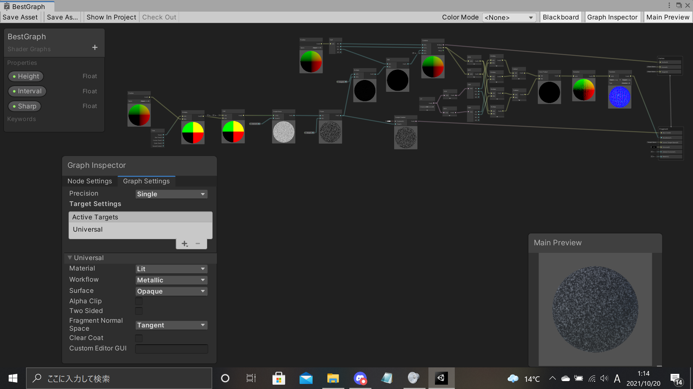

# 頂点の移動
頂点を動かし、適切にライティングを行います。

# 自分なりに変更した点
-時間で弾の色彩変化
-地面が揺れるように変化
-
# この後の授業でやって欲しい事
-unityと他デバイスとの連動
-
-

# 進め方

- 本リポジトリをフォークしてください
- フォークしたリポジトリをcloneします
- Unityのプロジェクトを更新して実装してください。
  - 結果画像1（一番上の画像）と同じシーンを「1 Height Scene」に実現してください
  - 結果画像2（二番目の画像）と同じシーンを「2 Color Scene」に実現してください
  - 結果画像3（三番目の画像）と同じシーンを「3 Normal Scene」に実現してください
  - 自分なりにかっこいいシーンを「4 My Best Scene」に作成してください
- 「4 My Best Scene」の結果をUnity RecorderでAnimation GIFとして保存し、result.gifという名前にして本ディレクトリの物と差し替えてください（サイズが大きくて上げられない場合は、解像度を小さくするなどして下さい）
- node_graph.pngを自分のシェーダグラフの一番頑張ったノードと差し替えてください
- このテキストファイルに変更点を記載してください
- このテキストファイルに「この後の授業でやって欲しい事」を記載してください
- プルリクエストを出して提出してください
