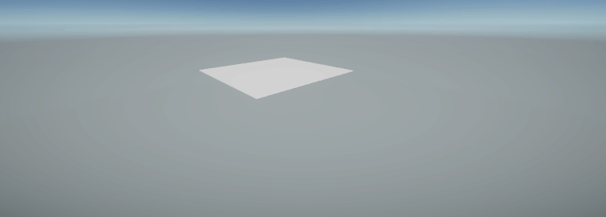
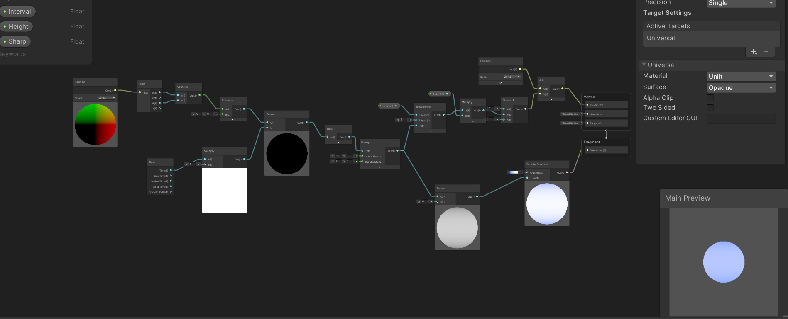

# 頂点の移動
頂点を動かし、適切にライティングを行います。

# 自分なりに変更した点
- Intervalの値をTimeノードによって変化させ、だんだん引きながら山脈を全体的に俯瞰していくような形にしてみました。
- 過去に特集されたNoiseノードを利用して、山脈の中に霧が流れているように見える仕様を追加してみました。
-
# この後の授業でやって欲しい事
- 毎回講義序盤に取り上げる、前回分で提出されたシェーダー作品に対して、先生が一工夫加えるとどのようになるのかが知りたいです。
- 差し支えなければ、その際にお話しする先生の追加点が、「どのような手法で実現されているのか？」という部分についても聞いてみたいです。
-

# 進め方

- 本リポジトリをフォークしてください
- フォークしたリポジトリをcloneします
- Unityのプロジェクトを更新して実装してください。
  - 結果画像1（一番上の画像）と同じシーンを「1 Height Scene」に実現してください
  - 結果画像2（二番目の画像）と同じシーンを「2 Color Scene」に実現してください
  - 結果画像3（三番目の画像）と同じシーンを「3 Normal Scene」に実現してください
  - 自分なりにかっこいいシーンを「4 My Best Scene」に作成してください
- 「4 My Best Scene」の結果をUnity RecorderでAnimation GIFとして保存し、result.gifという名前にして本ディレクトリの物と差し替えてください（サイズが大きくて上げられない場合は、解像度を小さくするなどして下さい）
- node_graph.pngを自分のシェーダグラフの一番頑張ったノードと差し替えてください
- このテキストファイルに変更点を記載してください
- このテキストファイルに「この後の授業でやって欲しい事」を記載してください
- プルリクエストを出して提出してください
